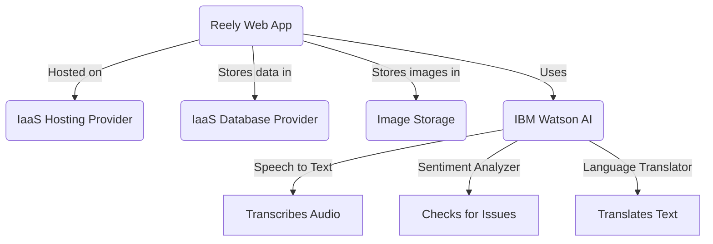
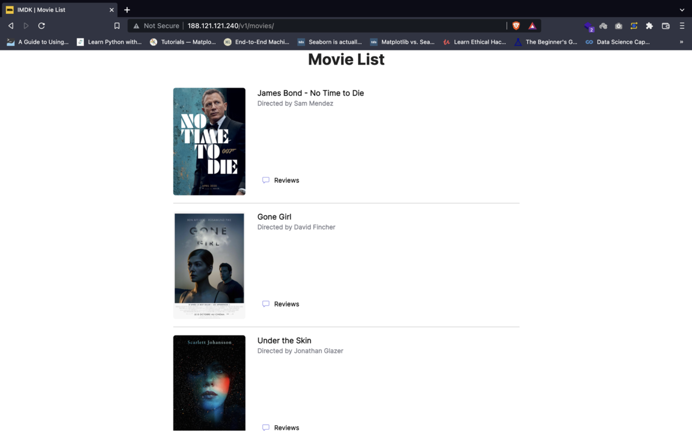

# Reely: A Movie Discussion app using Cloud Services

Reely is a simple movie discussion platform, that I developed with the aim of getting familiar with different [I/P/S]aaS cloud
services, as the first assignment of my bachelors cloud computing course. Built with Go and Gin, It utilizes IBM Watson
AI services to moderate movie discussions.

The full description of the project can be found in [instructions.pdf](docs/instructions.pdf)
and [report.pdf](docs/report.pdf) (in Persian).

## Project Overview

Users can submit voice comments about movies, which are processed through IBM Watson's AI APIs:

1. **Speech-to-Text API**: Transforms voice comments into text.
2. **Content Analysis API**: Analyzes comments for sentiment, content, and more.
3. **Language Translator API**: Translates comments into multiple languages.

Reely uses the following proxies to call these APIs. They are built to work with IBM but can be extended to other APIs:

- **[proxies/kateb.go](proxies/kateb.go)**: Audio to Text (Kateb means writer in Arabic!)
- **[proxis/human.go](proxies/human.go)**: Sentiment analysis
- **[proxies/dilmaj](proxies/dilmaj.go)**: Translation (Dilmaj means translator in Turkish)

### API Endpoints

- **GET /v1/movies/:movieID** - [Get a movie]
- **GET /v1/movies** - [Get all movies]
- **POST /v1/reviews/movies/:movieID** [Creates a new review for the specified movie]

The project can also be run as a docker container, using the provided [Dockerfile](Dockerfile).

## Architecture

This diagram shows Reely's architecture:

The database is assumed to be a PostgreSQL instance, and the connection is established through db/db.go. All credentials
should be stored according the [config/config.template.yaml](config/config.template.yaml), in two files named `config/development.yaml` and `config/production.yaml`.

## Demo

|          Home Page           |       Sample Movie Page       |
|:----------------------------:|:-----------------------------:|
|  |  |

## Course Information

- **Course**: Cloud Computing
- **University**: Amirkabir University of Technology
- **Semester**: Spring 2022

Let me know if you have any questions!

